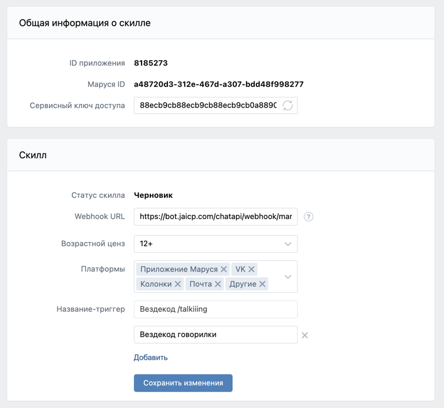

# Marusia 10-40
от /talkiiing

Готово:
- 10 баллов - приветствие на "Вездекод Говорилки" (/talkiiing)
- 20 баллов - "Викторина", содержащая смешные вопросы об айти, и Вездекоде. Отвечаешь правильно - проходишь дальше
- 30 баллов - Маруся умеет говорить! И даже расставляет где-то акценты через ^word^, а так же заменяет ссылки на "эта ссылка"
- 40 баллов - В этом навыке Марусе нравится шуметь, и она будет издавать различные звуки, и задавать вопросы с картинкой!

Мы решили что будем использовать как можно больше платформы - и вставили общение с Марусей голосом

## Реализация

Реализован с помощью конструктора Aimylogic из документации по Марусе в https://dev.vk.com, он позволяет собрать
необходимый сценарий в визуальном редакторе

Потыкать можно [здесь](https://skill-debugger.marusia.mail.ru/ "Нажми")

В поле вебхука введите эту строку:  
<https://bot.jaicp.com/chatapi/webhook/marusia/bMxWFnsf:c5337653e84bd65105f715e171ab6c7aa19d2e2a@a48720d3-312e-467d-a307-bdd48f998277>

Навык в конструкторе https://app.aimylogic.com/scenario/tuklya-1000034410-iLh?hash=1654423918778

## Конфиги

### Настройки навыка

### Логика бота

Скриншоты схемы: 

### Пример диалога

